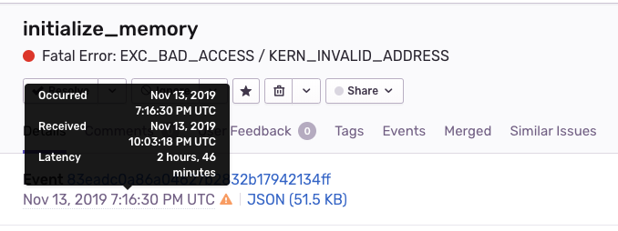

## Overview
The goal of this is to produce a native crash that gets captured / sent as event to Sentry.

This project is a demo implementation of **sentry-native**, the Sentry SDK for Native Crash Reporting which you can download here https://github.com/getsentry/sentry-native as a distribution zip for use in Production. This project uses it in its pakcaged release form - it is referenced as a submodule.

**Official Sentry Documentation**  
Use https://github.com/getsentry/sentry-native when ready to implement this in your real code.

## Setup
This is for running on Mac. See windows.txt for Windows.
1. `git clone --recurse-submodules git@github.com:sentry-demos/sentry-native.git`
2. `yarn global add @sentry/cli` to install *sentry-cli 1.49.0z*. You can also get it from https://github.com/getsentry/sentry-cli/releases/ or https://docs.sentry.io/cli/installation/

## Mac
1. `make bin/example`
2. `make setup_release`
3. `make upload_debug_files`
4. `make run_crash` or `make run_message`

`make clean` if you need to re-run `make bin/example` and upload new debug files.

## Technical Notes
### What's Happening
`make bin/example` creates debug symbols and executables  

`make setup_release` creates a Sentry Release and associates git commits

`make upload_debug_files` uploads your symbols to https://sentry.io/settings/${YOUR_ORG}/projects/${PROJECT}/debug-symbols/ which is Project Settings > Debug Files

`make run_crash` causes a native crash in *src/example.c*. It sends one event to Sentry

`make run_message` causes a Sentry Message to get sent as an event to Sentry.

`make clean` is for re-generating debug symbols and executables


## Troubleshooting
If your events are not symbolicated then run `make clean` and re-run commands from step 1

You need to always run `bin/example` before `setup_release`

If the standalone distribution package doesn't fit your needs, then go to https://github.com/getsentry/sentry-native#development

sentry-native in the news https://blog.sentry.io/2019/09/26/fixing-native-apps-with-sentry

## Gif


# Minidumps

You can `curl` your .dmp files directly to the Sentry API.

[Additional documentation - docs.sentry.io native/minidumps](https://docs.sentry.io/platforms/native/minidump/#minidump-additional)

?
> Note - Sentry Native is a wrapper around two most popular crash-reporting frameworks: Breakpad and Crashpad

## Setup
First you need to obtain your own Minidumps Endpoint for your Sentry Project. You will use this api endpoint as the basis for your curl command in the Run steps.
1. Project Settings > DSN Keys, click 'Expand' > Minidump Endpoint is given
2. Run a Mac [sentry-native](#sentry-native) crash to produce .dmp's that you can upload. They will get stored in `./sentry-db/completed`
3. Run the following with what you produced in steps 1,2 above:
```
curl -X POST \
  <your_minidump_endpoint> \
  -F upload_file_minidump=@<name_of_your_file>.dmp
```

## Run
1. `make run_crash` <-- but can't run the clean_db part or else the .dmp is missing. so...  
`SENTRY_DSN=https://b5ceabee4e4a4cd6b21afe3bd2cbbed4@sentry.io/1720457 bin/example --crash`
2. `cd ./sentry-db/completed`
3. 
```
curl -X POST \
  'https://sentry.io/api/1720457/minidump/?sentry_key=b5ceabee4e4a4cd6b21afe3bd2cbbed4' \
  -F upload_file_minidump=@b066e1b0-68ef-4d7a-8f59-e59ad0e63d8d.dmp
```
try it with JSON for release + tags
```
curl -X POST \
  'https://sentry.io/api/1720457/minidump/?sentry_key=b5ceabee4e4a4cd6b21afe3bd2cbbed4' \
  -F upload_file_minidump=@40467503-6652-4dd5-8c7b-d63c7e29a649.dmp \
  -F 'sentry={"release":"1.2.3","tags":{"myotag":"value"}}'
```
4. try with Line-separated ("flattened") for release + tags

#### What Native Crash Looks Like?
- the 'myotag' tag appeared under heatmap, but not under TAGS section
- 'release' appeared on rt-side sidebar and heatmap, but not under TAGS section <-- could be a general upload problem
- the 'histag' did same, but 'myotag' is still there?

#### What Capture Message Looks Like?
It is a .dmp sent with the Capture Message? Does Capture Message return an exit status to the C/C++ function?
- no tag and no release shown

#### This curl dmp is producing 1 or 2?
- Looks like it's producing 2, interesting.

#### Release and Tags
- Breadcrumbs? (a lot of work, formatting-wise)
- Release and Tags sufficient? that's what our documentation covers

#### Note
- You can do it with your own .dmp? any .dmp will work?
- Event time and Processing time may differ, depending on how long you wait between generating the event (native crash) and curl'ing it to sentry.io/api.
